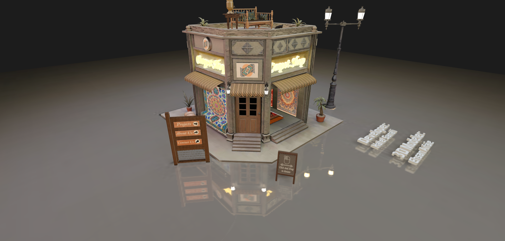

# My Portfolio

A beautiful 3D portfolio website built with Three.js.

## 🚀 Features

- **3D Environment**: Immersive 3D experience using Three.js
- **Animated Camera**: Smooth camera transitions with GSAP
- **3D Models**: Interactive 3D models including an animated cat
- **Custom Shaders**: GLSL shaders for special effects (overlay, reflective, smoke)
- **Loading Manager**: Progress tracking during asset loading
- **Debug Tools**: Built-in debugging with lil-gui
- **Performance Monitoring**: stats.js integration

## Demo

[Live Demo](https://my-portfolio-two-pink-22.vercel.app/)


## 🛠️ Tech Stack

- **Three.js**: 3D rendering library
- **Vite**: Build tool and dev server
- **GSAP**: Animation library
- **lil-gui**: Debug GUI
- **stats.js**: Performance monitor
- **vite-plugin-glsl**: GLSL shader support

## 📦 Installation

```bash
# Install dependencies
npm install
```

## 🎮 Usage

### Development

```bash
# Start development server
npm run dev
```

### Build

```bash
# Build for production
npm run build
```

### Preview

```bash
# Preview production build
npm run preview
```

## 📁 Project Structure

```
MyPortfolio/
├── public/
├── src/
│   ├── Envirement/
│   │   ├── CameraAnimation/    # Camera transition animations
│   │   ├── Utils/              # Utility classes
│   │   ├── World/              # 3D world elements
│   │   ├── Camera.js           # Camera setup
│   │   ├── Experience.js       # Main experience class
│   │   ├── LoadingManger.js    # Loading manager
│   │   ├── Raycast.js          # Raycasting for interactions
│   │   ├── Renderer.js         # Renderer setup
│   │   └── assets.js           # Asset definitions
│   ├── Shaders/                # GLSL shaders
│   ├── main.js                 # Entry point
│   ├── index.html
│   └── style.css
├── static/
│   ├── models/                 # 3D models (.glb)
│   └── texture/                # Textures
├── package.json
├── vite.config.js
└── README.md
```

## 🎨 Key Components

- **Experience**: Singleton class that orchestrates the entire 3D scene
- **Camera**: Handles camera setup and animations
- **World**: Manages all 3D objects in the scene
- **Resources**: Loads and manages 3D models and textures

## ✨ Credits

Built with ❤️ using modern web technologies.
